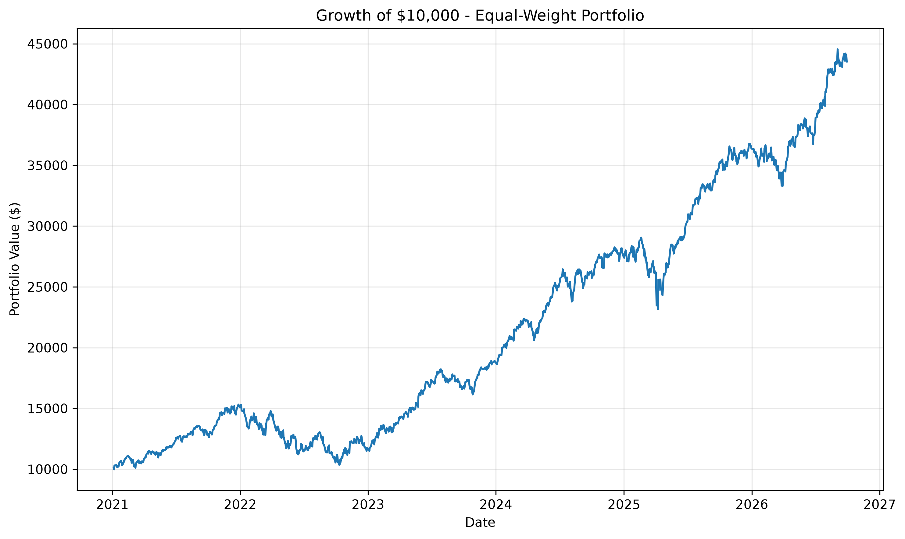
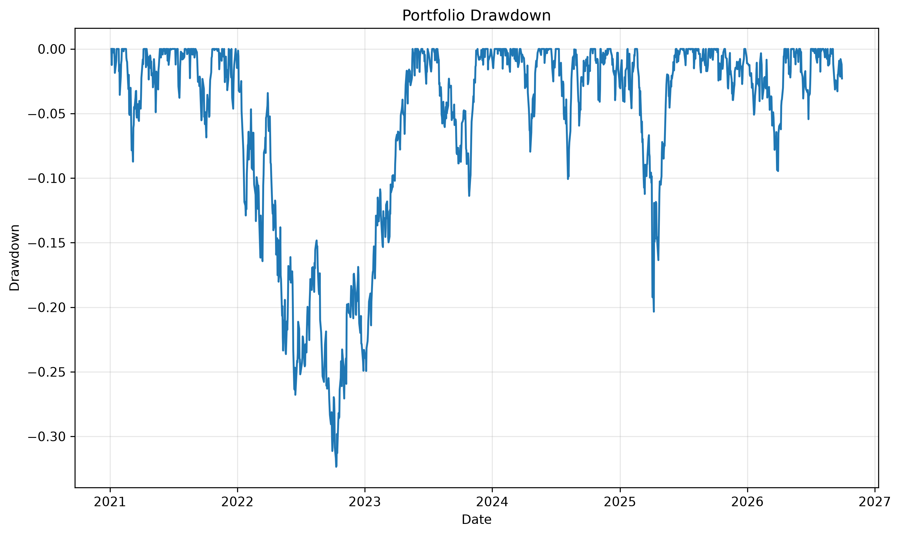
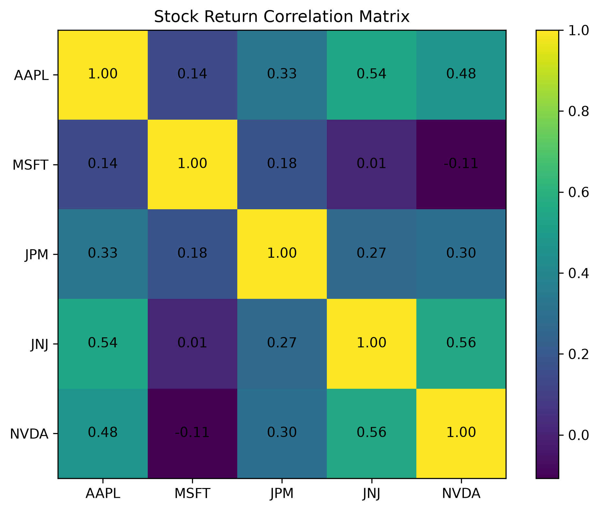

# Portfolio Risk & Analytics Lab

A Python-based quantitative finance project for analyzing stock performance, portfolio risk, diversification, and risk-adjusted returns.

## Overview

This project uses historical market data for **AAPL, MSFT, JPM, JNJ, and NVDA** starting in January 2021. It turns daily price data into portfolio-level risk and performance metrics and visualizations.

The current version uses an equal-weight portfolio, with 20% allocated to each stock.

## Analysis Included

- Daily stock returns
- Annualized returns
- Annualized volatility
- Sharpe ratios
- Maximum drawdowns
- Stock return correlations
- Annualized covariance matrix
- Equal-weight portfolio construction
- Portfolio return and volatility
- Portfolio Sharpe ratio
- Growth of a $10,000 investment
- Portfolio drawdown analysis
- S&P 500 benchmark comparison
- Portfolio beta
- CAPM expected return
- Jensen's alpha

## Why This Project Matters

Looking only at return can hide a large part of an investment's risk.

This project compares return with volatility, drawdown, correlation, market sensitivity, and risk-adjusted performance. It also demonstrates how combining assets that are not perfectly correlated can reduce portfolio volatility and uses the S&P 500 as a benchmark for evaluating relative performance.

## Visualizations

### Growth of $10,000



### Portfolio Drawdown



### Correlation Matrix



## Tech Stack

- Python
- pandas
- NumPy
- Matplotlib
- yfinance

## How to Run

Clone the repository and install the required Python packages:

```bash
pip install yfinance pandas matplotlib numpy
python main.py
```

The script downloads historical market data using yfinance, calculates the portfolio metrics, and generates the analysis output and charts.

## Methodology & Limitations

The analysis is backward-looking and is based on historical market data for a selected five-stock portfolio. Annualized return, volatility, Sharpe ratio, beta, CAPM expected return, and Jensen's alpha are calculated from the historical sample and should not be interpreted as forecasts of future performance.

A positive historical alpha does not demonstrate that the portfolio will continue to outperform the market. The current analysis does not test statistical significance or out-of-sample performance and does not account for transaction costs, taxes, trading constraints, or changes in portfolio composition over time.

These limitations are important when interpreting the results and will be addressed further as the project adds optimization and backtesting.

## Current Stage

This project is actively being developed. The current version focuses on an equal-weight five-stock portfolio and includes comparison with the S&P 500.

Planned improvements include:

- Expand the portfolio to more assets
- Compare equal-weight and optimized portfolios
- Add rolling risk metrics
- Improve automated reporting
- Add portfolio optimization and backtesting

## Key Concepts Demonstrated

Portfolio risk · Diversification · Volatility · Sharpe ratio · Drawdown · Correlation · Covariance · Beta · CAPM · Jensen's alpha · Benchmarking · Historical market data · Python financial analysis
