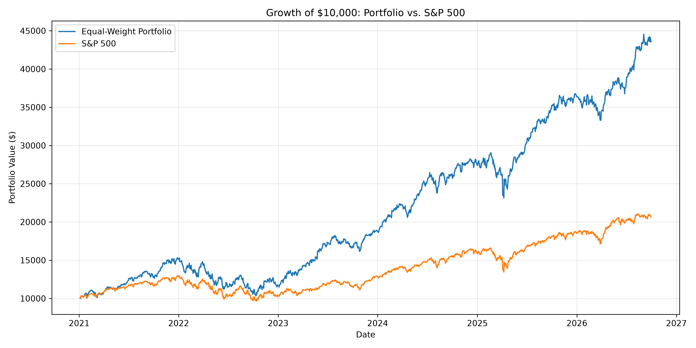
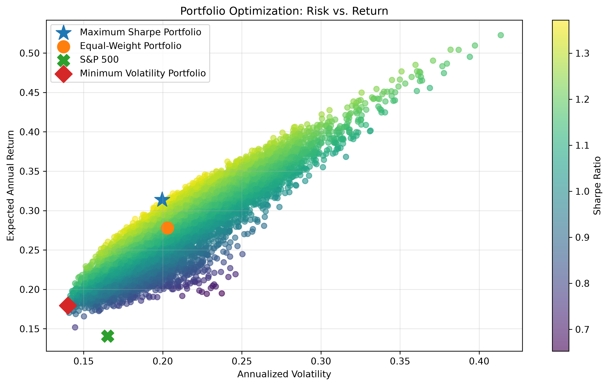

# Portfolio Risk & Analytics Lab

A Python-based quantitative finance project for analyzing stock performance, portfolio risk, diversification, benchmark performance, and portfolio construction.

## Overview

This project uses historical market data for **AAPL, MSFT, JPM, JNJ, and NVDA** starting in January 2021. It turns daily price data into portfolio-level risk and performance metrics, compares an equal-weight portfolio with the S&P 500, and explores alternative portfolio weights using Monte Carlo simulation.

The baseline portfolio allocates 20% to each stock.

## Portfolio vs. S&P 500

Starting with the same hypothetical **$10,000 investment**, the historical sample produced:

| Investment | Final Value |
| --- | ---: |
| Equal-weight portfolio | $43,539.04 |
| S&P 500 | $20,676.21 |
| Difference | $22,862.84 |



This is a historical comparison over the project's sample period, not a forecast of future returns.

## Portfolio Optimization

The project simulates **10,000 randomly weighted portfolios** using the same five stocks. Each simulated portfolio is evaluated using expected annual return, annualized volatility, and Sharpe ratio.

The simulation identifies:

- A maximum-Sharpe portfolio, which searches for the strongest historical risk-adjusted return among the simulated portfolios
- A minimum-volatility portfolio, which searches for the lowest historical volatility among the simulated portfolios
- The original equal-weight portfolio
- The S&P 500 benchmark



One sample run produced:

| Portfolio | Expected Return | Volatility | Sharpe Ratio |
| --- | ---: | ---: | ---: |
| Equal-weight portfolio | 27.80% | 20.29% | 1.17 |
| Maximum-Sharpe simulation | 31.37% | 19.96% | 1.37 |
| Minimum-volatility simulation | 17.94% | 14.00% | 1.00 |

Because the optimization uses randomly generated portfolio weights, the exact maximum-Sharpe and minimum-volatility results can vary slightly between runs.

## Analysis Included

- Daily stock returns
- Annualized returns
- Annualized volatility
- Sharpe ratios
- Maximum drawdowns
- Correlation matrix
- Annualized covariance matrix
- Equal-weight portfolio construction
- Portfolio return and volatility
- Portfolio Sharpe ratio
- Growth of a $10,000 investment
- Portfolio drawdown analysis
- S&P 500 benchmark comparison
- Portfolio beta
- CAPM expected return
- Jensen's alpha
- Monte Carlo portfolio simulation
- Maximum-Sharpe portfolio search
- Minimum-volatility portfolio search
- Risk-return visualization

## Why This Project Matters

Looking only at return can hide a large part of an investment's risk.

This project compares return with volatility, drawdown, correlation, market sensitivity, and risk-adjusted performance. It also demonstrates diversification, benchmark analysis, and the tradeoff between maximizing risk-adjusted return and minimizing volatility.

## Additional Visualizations

### Portfolio Drawdown


### Correlation Matrix


## Tech Stack

- Python
- pandas
- NumPy
- Matplotlib
- yfinance

## How to Run

Clone the repository and install the required Python packages:

```bash
pip install yfinance pandas matplotlib numpy
python main.py
```

The script downloads historical market data, calculates the portfolio metrics, runs the Monte Carlo simulation, and generates the analysis output and charts.

## Methodology & Limitations

The analysis is backward-looking and is based on historical market data for a selected five-stock portfolio.

Annualized return, volatility, Sharpe ratio, beta, CAPM expected return, and Jensen's alpha are calculated from the historical sample and should not be interpreted as forecasts of future performance.

The Monte Carlo section tests 10,000 randomly generated long-only portfolio allocations. It does not mathematically solve for a guaranteed global optimum, and its exact results can change between runs.

The analysis also does not test statistical significance or out-of-sample performance and does not account for transaction costs, taxes, trading constraints beyond long-only weights, or changes in portfolio composition over time.

## Current Stage

This version is complete as a foundational portfolio-risk project.

Possible future extensions include:

- Expanding the portfolio to more assets
- Rolling volatility and rolling Sharpe ratios
- More formal portfolio optimization
- Out-of-sample backtesting
- Automated reporting

## Key Concepts Demonstrated

Portfolio risk · Diversification · Volatility · Sharpe ratio · Drawdown · Correlation · Covariance · Beta · CAPM · Jensen's alpha · Benchmarking · Monte Carlo simulation · Portfolio construction · Historical market data · Python financial analysis
